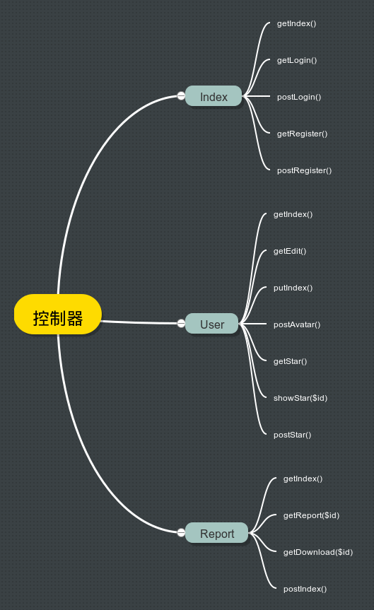
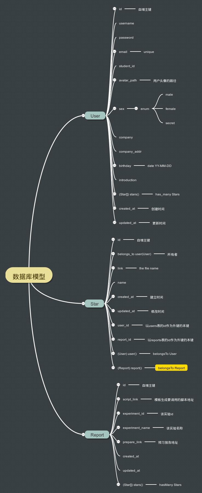
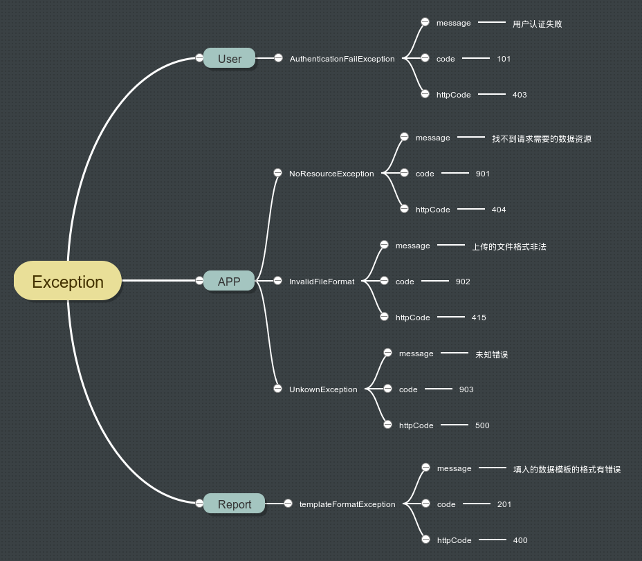
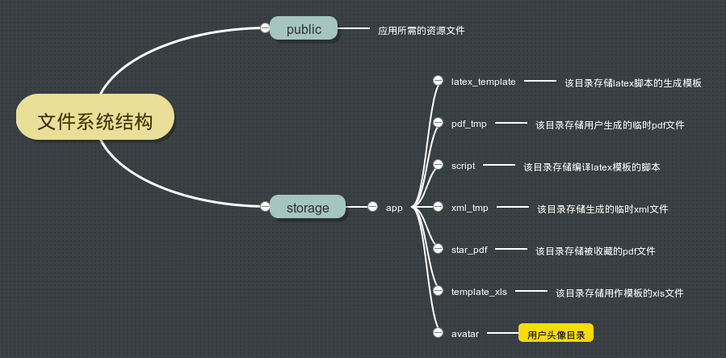
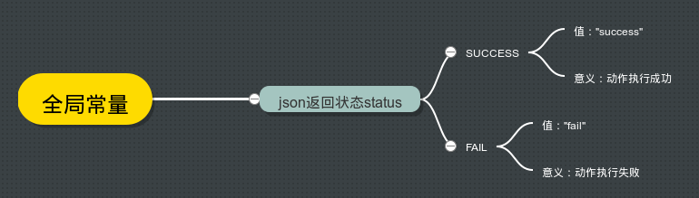
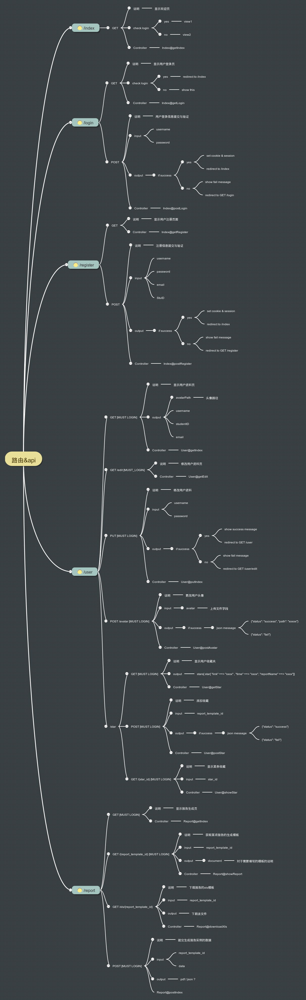

# 技术规格说明书
版本号:v1.3

修订日志：

版本号 | 修订记录
---- | ----
v1.0 | 完成后端逻辑设计初稿
v1.1 | 根据界面的设计更改作出相应调整
v1.2 | 加入后端技术概览
v1.3 | 技术规格说明书诞生

## 1.技术概览

### 1.1后端框架选用
本项目后端采用[laravel框架](http://laravel-china.org/)，该框架为PHP框架，选用该框架的原因有如下几点：

* PHP语法简单，上手快速
* laravel框架是2015年调查中所有PHP框架中使用占比高达50%的一个框架，深受国内外开发者的喜爱
* laravel框架有相对成熟的社区和优雅的框架结构，容易上手
* laravel很多文档都有中文对应版，对中文开发者友好

### 1.2前端框架使用

本项目前端采用的是[bootsrap框架](http://www.bootcss.com/)。之所以一开始没有考虑其他的前端框架是因为bootstrap框架本身非常符合我们的物理实验网站的定位：简洁，优雅，专注于工具。并且bootstrap框架的可定制性更强，相比其他框架而言在后期能更改样式的空间更大。

### 1.3其他技术选用

在项目团队的发展中，我们选用了`latex`作为生成报告的主要语言与工具，使用[jinja2](http://docs.jinkan.org/docs/jinja2/)作为主要的后端模版渲染引擎。

## 2.详细技术说明

本项目的主打功能根据实验数据生成物理实验报告的具体流程如下：
用户点击`导入实验数据`按钮时，将弹出模框，让用户在模框的表格中输入实验数据。当实验数据输入完毕后，点击`提交`按钮，后端使用latex生成PDF，在几秒后端完成工作后将PDF返回给前端进行展示。

### 2.1 laravel框架

* laravel框架使用的是mvc模型分层，并且使用mysql数据库和apache提供web服务。
* 我们使用路由规范前端访问的请求路径与方式和后端的控制器相对应，路由采用http2的风格，包括get，post，put，delete四种请求方式。
* 在视图方面，使用blade模板进行继承和渲染，提高代码重用和前后端的分离。
* 在数据库和数据操作方面，使用`Eloquent ORM`，封装对数据的处理和与数据库的交互，封装其外键关系，在数据库结构建立方面，使用laravel的数据迁移和填充机制，只需要使用命令建立好带有时间戳的迁移和填充文件就可以执行数据库结构的建立和回滚。
* 在异常处理方面，自定义异常类和统一的异常处理接口，并根据请求的方式返回包含异常信息的json或者 包含动态参数的异常提示页面。
* 使用laravel的表单验证机制，对所有非get表单字段都定义了相应的验证规则和验证提示信息，只有提交的字段值满足了相应的规则，该控制器才会正常执行，否则会抛出异常。
* 使用中间件，对用户请求进行判断和第一步的处理，在路由层面注册对用户登陆进行验证的中间件，已返回不同信息或者跳转。
* 为防止`csrf`攻击，在每一位用户的`session`中放置随机`token`，这个 `token` 将被用来确保经过验证的用户是实际发出请求至应用程序的用户。该`token`应插入到任何表单的隐藏字段中。
* 为放置`sql`注入的发生，几乎杜绝使用原生的`sql`查询，使用`ORM`和`laravel`提供的链式查询机制，让框架编译`sql`语言进行查询，既保证了开发效率又提高了安全性。
* 在数据存储方面，只有前端资源才会存储到`public`文件夹，其余的系统资源都会放置与`storage`文件夹下，该目录经过对`apache`的配置网站是无法通过用户自定义的请求访问到的。提高网站的安全性。
* 考虑到迭代和解耦，将自定义的全局变量、扩展的表单验证规则、自定义的辅助方法等，都定义在应用的服务提供者文件中，这样会加载到全局。

### 2.2 bootstrap框架
bootstrap框架提供了非常丰富的CSS样式，也可以从源码定制自己所需要的样式，所以给我们造就了比较大的自定义空间。

### 2.3 latex生成PDF

Latex生成PDF这里是我们项目的技术核心，有一套完整的流程与机制。

在导入实验数据时，前端要发送请求到后端，传入的是一个带有原始数据的xml文本。后端在接受到请求后解析到根结点的ID，并启用相应的`python脚本`，在脚本中按如下流程对前端传入的xml文件进行解析：
* 解析子结点`<sublab>`标签个数，并通过它们的ID找到对应的实验数据处理程序，导入`latex`导言区。
* 在每一个子结点`<sublab>`标签的解析过程中，先导入标准的物理数据处理`latex`模板。模板中带有诸如`%% A %%`类似的变量替换名和``类似的逻辑语句。
* 在实验数据处理的过程中，一方面计算数据，将所有的中间变量或者结果变量的值全部保留在全局变量中。另一方面，在计算完某个小实验的数据后，使用模板进行逻辑变量替换。
* 使用`jinja2`引擎对模板进行渲染后，在脚本中调用shell命令，使用`xelatex`命令进行PDF的生成。在生成后，脚本返回状态码为`success`，在php中接受到成功的状态码，向前端返回`json`数据，告知前端成功完成，并附带要显示的PDF的服务器路径，前端此时使用`pdfobject.js`进行动态加载显示。

### 2.4 jinja2后端模板渲染

`jinja2`是一个可以定制变量替换名和自定义逻辑控制语句的轻量级模板，其功能非常强大，而在本项目中用到的东西并不多。使用了`Environment`而不是`Template`类进行替换与渲染。

## 3.API接口图

以下为我们团队的框架设计师为团队所制作的API接口文档图，该图较为清晰地展示了API接口以及全局的后端逻辑结构，相对思路更加具体细致。

### 3.1. 控制器框架

### 3.2. 数据库模型框架

### 3.3. 抛出异常框架

### 3.4. 文件系统结构

### 3.5. 全局变量

### 3.6. 路由&API
